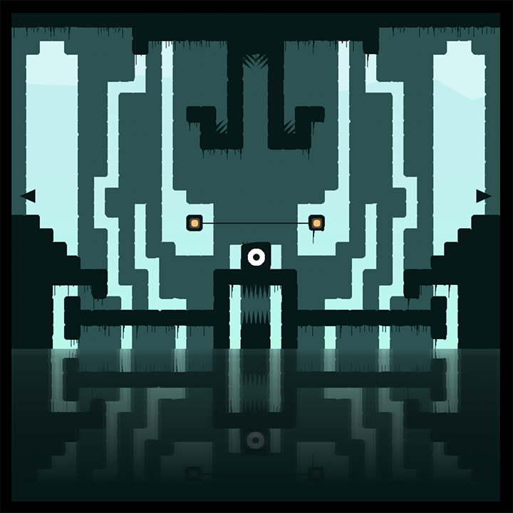

# EYESORE!

[EYESORE!](https://studiouniverse.co/eyesore/) is a short puzzle-platformer built for the [JS13K 2017](http://2017.js13kgames.com/) competition. The theme was "lost" this year (or [LOST](https://www.youtube.com/watch?v=ZYfKHVdmjzQ) as I prefer to see it).

Everything was done by me [@alpearcedev](https://twitter.com/alpearcedev). It took me around 3 weeks on/off to finish.

Thanks to my friends for playtesting, and my girlfriend for putting up with me during this ordeal! (I saw 4am more often than I care to admit).

I'll revise this readme and do a full review after the competition has passed.

Code
---

*CHROME ISSUE* THE GAME MUST BE PLAYED ON LOCALHOST OR A SERVER DUE TO `context.getImageData`. (I'm pretty sure WebGL has a similar issue). Levels are created by reading each pixel in the .gif files. Due to browser Chrome cross-origin policies, reading image data when being served over the file system (file://) doesn't work.

Creating levels using .gifs in Photoshop (super zoomed-in, with pencil tool) is neat.

I didn't have time to make all the code look nice, it should all be readable, but entities.js and collisions.js are a bit of an eyesore...

There are also a few code eccentricities, mainly to help Uglify do it's thing e.g. I use 'directions' instead of 'direction'.

Gameplay
---

One thing that grinds my gears is how terrible the control schemes tend to be on mobile platformers, and so I wanted to attempt to address this. My solution was removing the jump button! This was really the tipping point for me in realising how my game and the level design and puzzles could work and start coming together.

The player climbs walls when you 'walk' into them, with a simple jump-esque animation. In my head, he's kind of bounding up them.

There are 4 puzzle levels, plus the start level.

You can play the game in reverse if you go all the way left while in the start level.

You cling to ceilings automatically. I tried to make this obvious without 'telling' the player - I really like how games like [The Witness](https://www.wikiwand.com/en/The_Witness_(2016_video_game)) let the player learn to play by encouraging experimentation.

The third puzzle level seems to have the most challenging puzzle - I promise it's possible, the level's not broken!

Compression
---

I managed to get the final ZIP to weigh in at ~11-12kb.

1) Run gulp to concatenate the JS (creates l-concat.js)
2) Run this uglify command to minify (creates /dist/l.js)

`uglifyjs --compress --mangle --mangle-props --output ./dist/l.js -- ./l-concat.js`

Omissions
---

I'm not great at making music, and felt it would distract me too much from the design and gameplay, which I wanted to focus on.

I would've liked to add more levels, but the gifs take up too much space.

More animations, and maybe some particle effects, would have also been a nice touch. Had some nice ideas for dying/reviving where your old body turns to 'ash', and your new body grows at the start from that ash.

Fun fact: in one version of the game your dead body became part of the level permanently, but I quickly removed the feature when I thought about all the problems that could cause.
